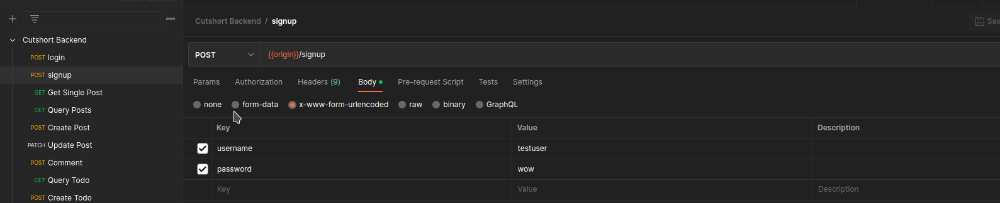
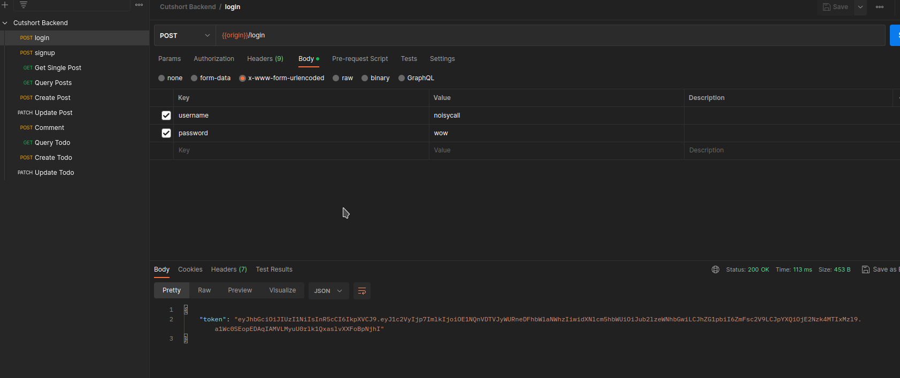
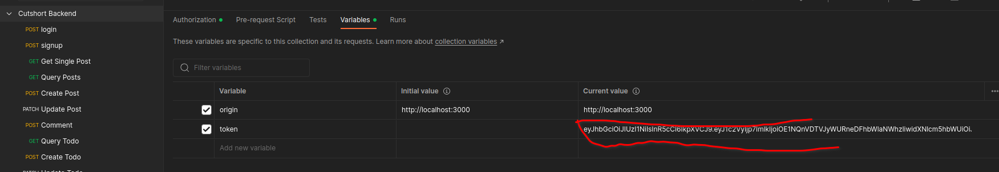

# Todo Backend
- Postman Collection - [collection](https://www.postman.com/noisycall/workspace/cutshortbackend/collection/7984119-c837e750-feb9-40d1-b88e-e3b2038dd65c?action=share&creator=7984119)
- Refer this collection for all endpoints and usage examples
## Description
- APIs for a simple social media app with Posts and Todos
- Hosted at todo.noisycall.com (Self hosted on a web server)
- Uses Firebase Firestore as the primary Non-Relational, Document DB
- Uses ExpressJS as the API Framework
- Uses PassportJS to facilitate Login/Signup and JWT authentication

## How to Login
**Authentication is done via bearer token, which is a JWT returned after login**

First, Create an account

Next Login and get returned token

Place the token in this location, and the rest of the apis will start working

## Update Requests
- All fields are optional and example queries are provided in Postman.

## Structure
### Auth
- The auth file sets up Passport JS
- Each user creates an account at /signup
- Each user can login at /login
- Every route that requires checking authentication is under the /secured route
  - It authenticates the user is valid based on a JWT passed as Bearer Token
### Models
- Each Model contains one of the primary data structures as well as a helper class to manage CRUD operations on that structure
- Posts, Todos and Users are the main data models
#### Posts
- Users can perform basic CRUD operations on Posts
- All queries happen in reverse chronological order and offset based pagination is available for the same
- Any user can query any users posts
- Only the creating user can update their post
- Any user can post a comment on a post
- Admin can edit anyone's post (not implemented but provision is created) 

#### Todos
- Users can perform basic CRUD operations on Todos
- All queries happen in reverse chronological order and offset based pagination is available for the same
- Any user can query any users Todos
- Only the creating user can update their Todo
- Only the creating user can mark a Todo as "complete"
- Admin can edit anyone's todo (not implemented but provision is created)

#### Users
- Users class helps perform CRUD operations on users
- User is created via /signup, then they authenticate and get a token using /login
- Profile cannot be edited in this version but provisions can be made to update username and password without affecting posts/todos

